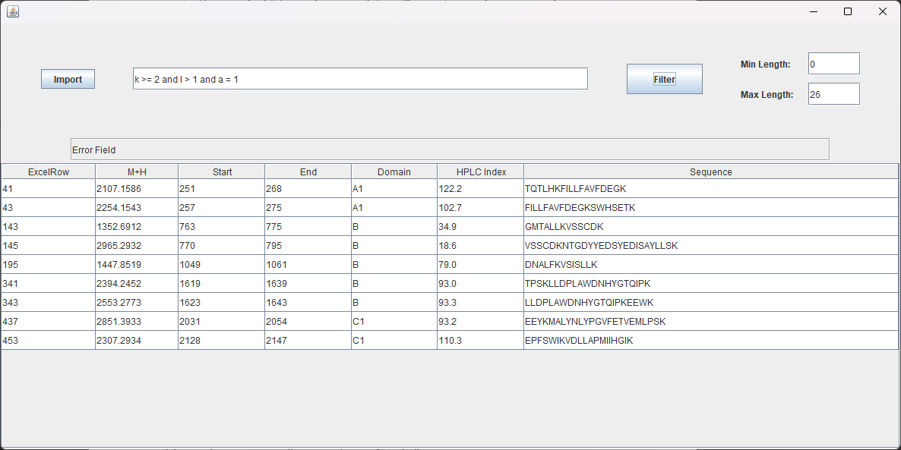

# AminoFinder

Written to make it easier to filter through an excel sheet and find peptides that contain chains of specific amino acids. The user does this by entering boolean expression into the command line at the top of the program.
Programmed in Java using the lovely swing ui. :)
Contains manual written in swedish meant for semi tech savvy researchers.

